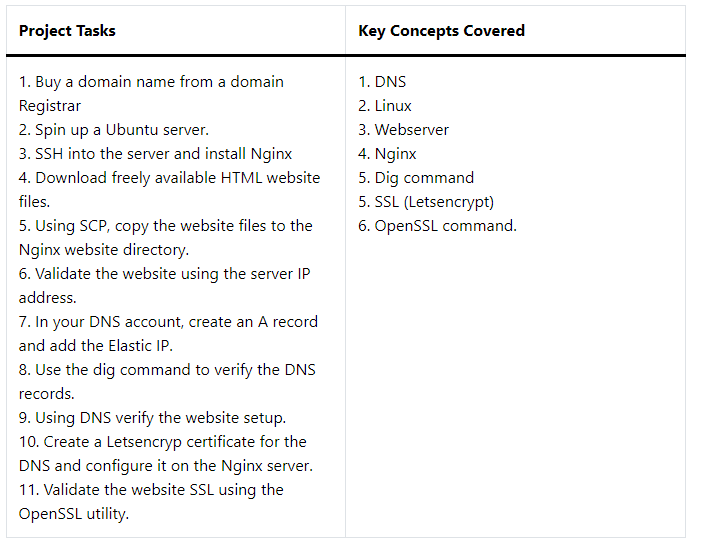

# Project Prerequsite

- 1 Open an [AWS ACCOUNT](https://www.googleadservices.com/pagead/aclk?sa=L&ai=DChcSEwiiud_K5PWDAxXaaUcBHXk1DIsYABAAGgJxdQ&ase=2&gclid=Cj0KCQiAh8OtBhCQARIsAIkWb6_8dRONbzczxip0iCBXWbQfznY39AZj7QVVu5aFOJUPYExe4s9cWQYaAp7FEALw_wcB&ei=UeKwZaq9FImQxc8PnLiJkAM&ohost=www.google.com&cid=CAESVeD26-ZLTaCtkOwQ4xmwh2XHc20AcjYx594xvpRb1yjwtenvRkRU5-U8tZvaQ3OCBlvdMZSfBo5wH1xBVTFCus7rxuOMNV5Snjb34KwOOQw9siv3VKA&sig=AOD64_0KR-DDwk2I0e_tnQeIm3pQm1ZHRQ&q&sqi=2&nis=4&adurl&ved=2ahUKEwjqqdbK5PWDAxUJSPEDHRxcAjIQ0Qx6BAgNEAE)

## launch an EC2 instance 

- Click on EC2 

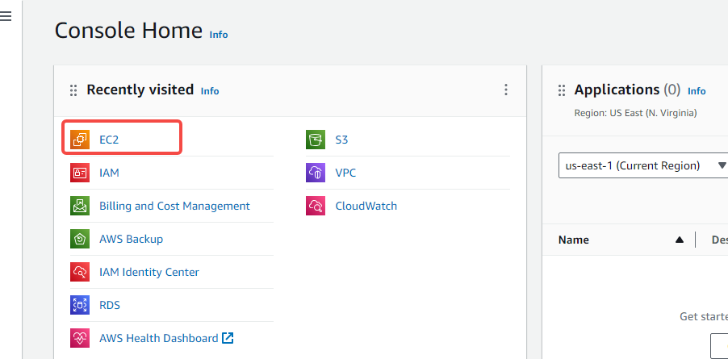

- Launch Instance

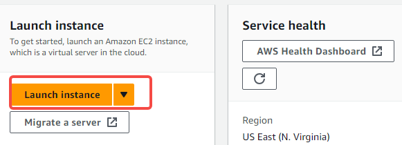

- Name your webserver

- Choose your Machine Image  (AMI)
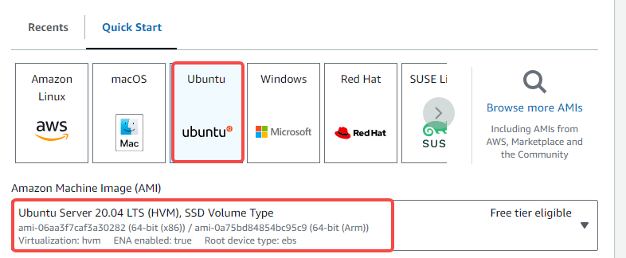

- Choose your instance type (in this case we are using t.2micro it is free tier eligible)

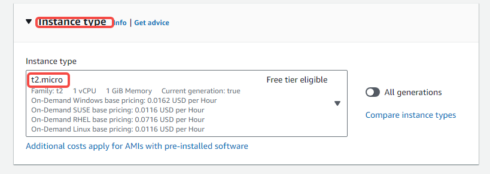

- Create a key pair 
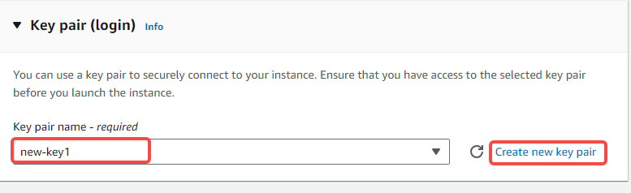

- Create Security Group
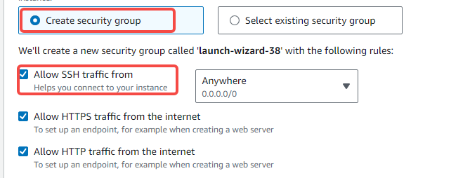

- Launch your instance
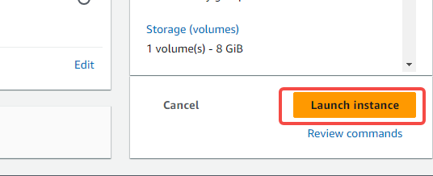

- When you have successfully launched your instance
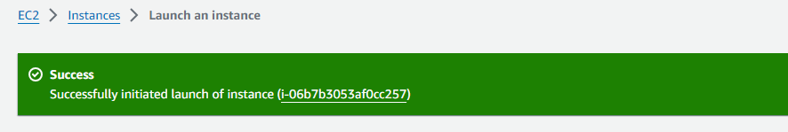

### Allocate Elastic IP address
- On the Ec2 Cosole search for Elastic IP and click on it 


- Allocate IP Address


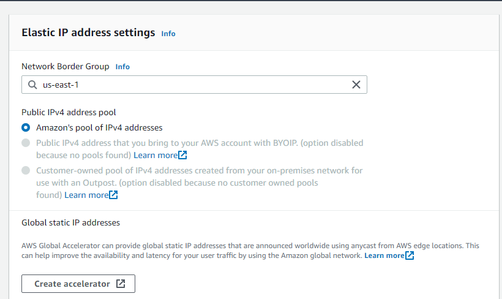
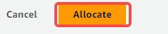

### Associate Elastic IP Address
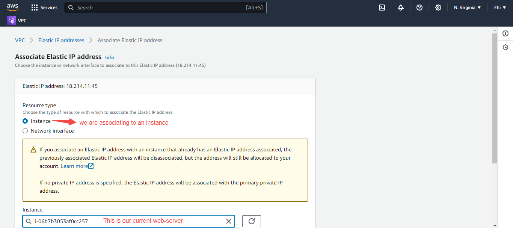

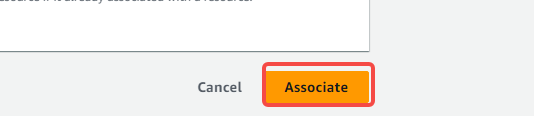

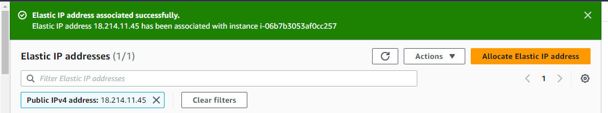

- Connect to your webserver


- Use the ssh client string for connection on the terminal
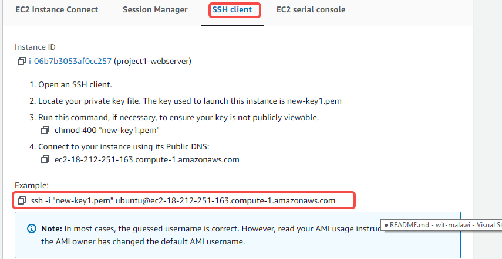
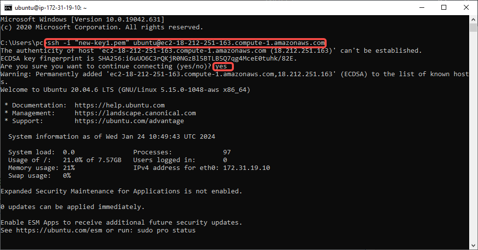

### Update and Upgrade Packages:

- Ensure your system is up-to-date
- On the terminal Run

```
sudo apt-get update
sudo apt-get upgrade -y

```
### Install Nginx:
`sudo apt-get install nginx -y
`

### Start Nginx and Enable on Boot:
`sudo systemctl start nginx`
`
 - ### Enable Nginx on boot:
    `sudo systemctl enable nginx`
`
  - ### Check if Nginx is running:
    `sudo systemctl status nginx`

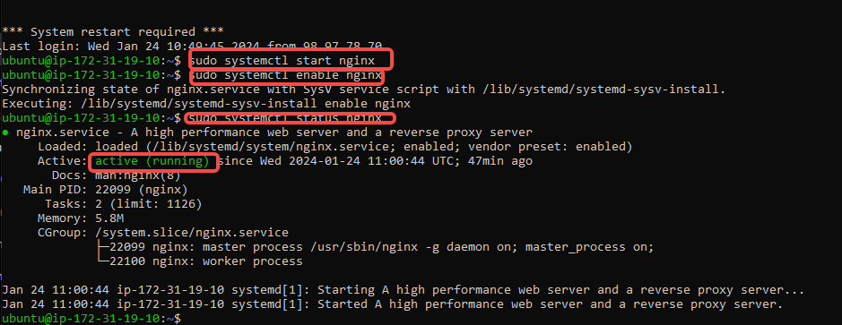

- Navigate into the common default location for web server document
`cd /var/www/html`

- Visit [Tooplate.com](https://www.tooplate.com/)

- Pick the template you want

- Right click on the page and click on inspect
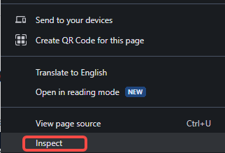

- Click on network

- Click download on the website

- Navigate to network
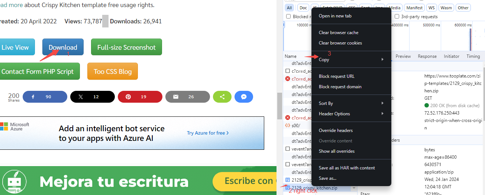

- Run the following command
`curl -o /var/www/html/2129_crispy_kitchen.zip https://www.tooplate.com/zip-templates/2129_crispy_kitchen.zip`

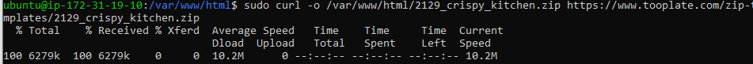

- 2129_crispy_kitchen template id
- tooplate.com (website)
- `ls`
- 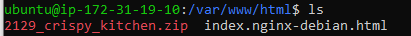

### Unzip the file: 
`sudo apt install unzip`

- Run the following command to unzip the template
` sudo unzip 2129_crispy_kitchen.zip`
`sudo nano /etc/nginx/sites-available/default`
`sudo systemctl restart nginx`

- Use the Public Ip to see if your website is showing
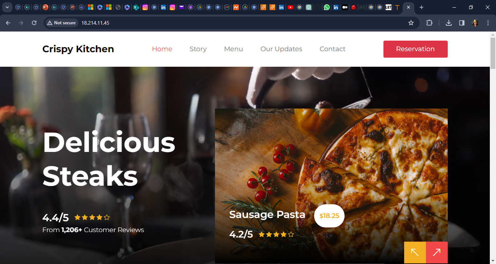

### Register A New Domain Name And Configure Secured Connection Using SSL/TLS Certificates

- Click on Route 53 on your Aws console
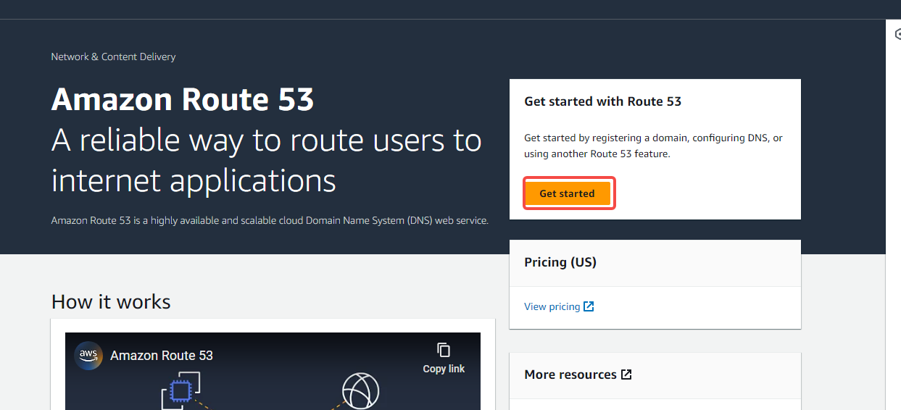

- Create hosted Zone
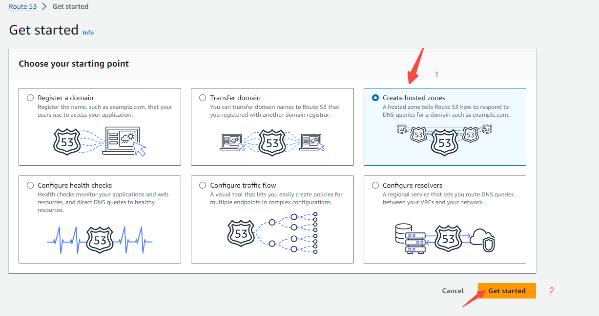
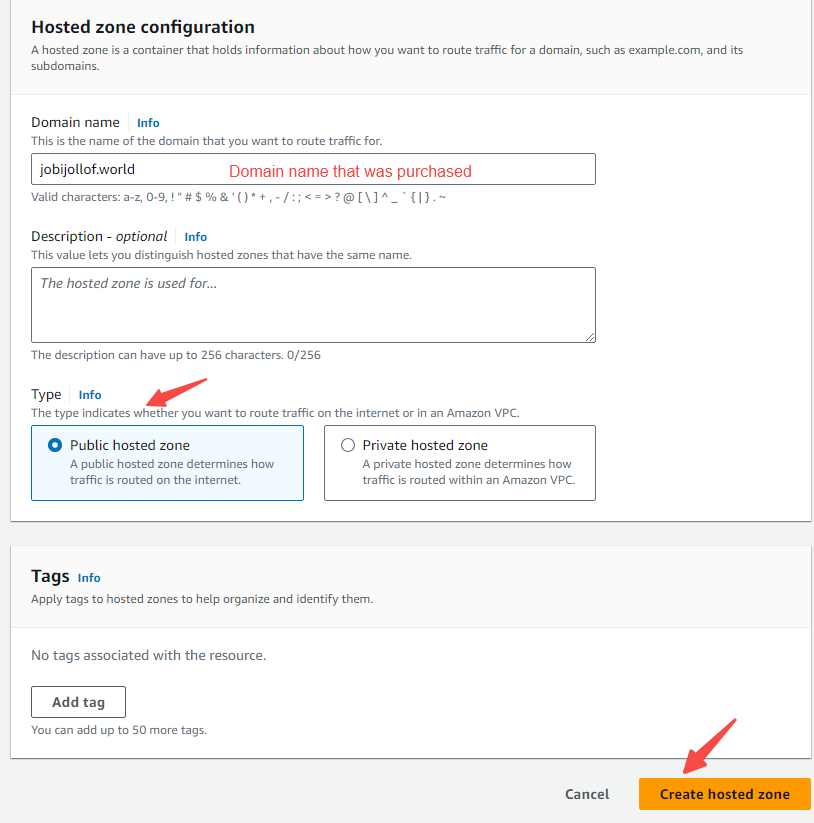

- Create Record
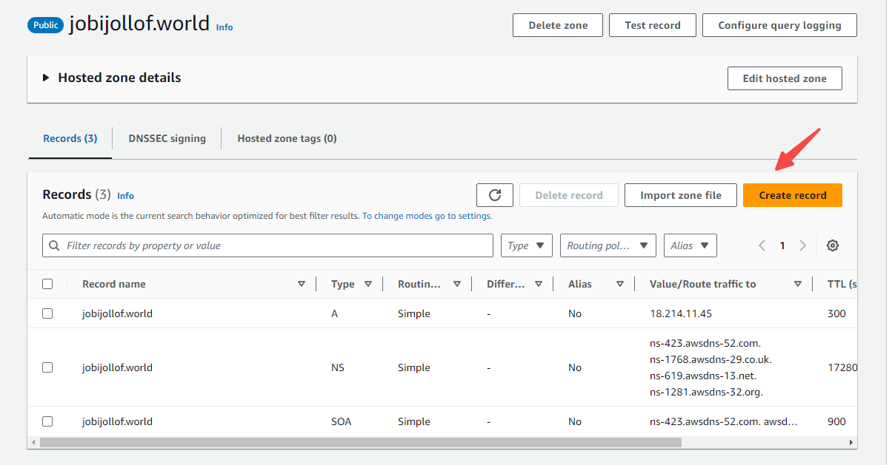
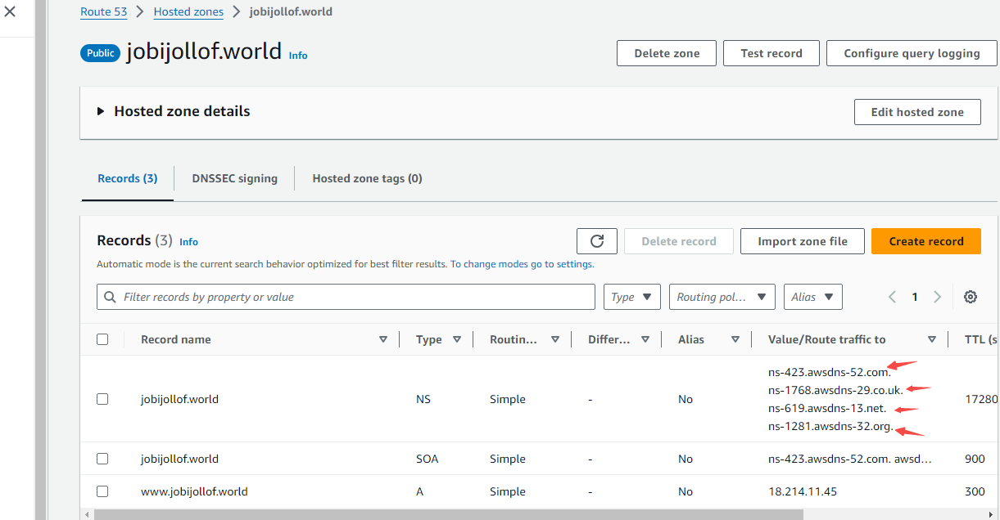

- Go Namecheap to add webservers [helpful article](https://www.namecheap.com/support/knowledgebase/article.aspx/10371/2208/how-do-i-link-my-domain-to-amazon-web-services/)

- 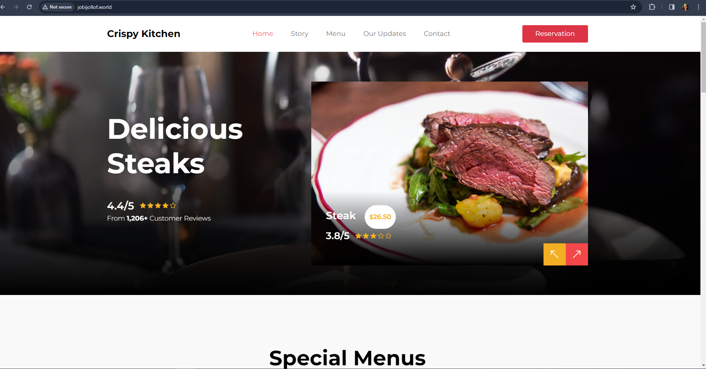
  


https://github.com/Jobijollof/DevOps-Projects3/assets/113374279/3df81bc1-126e-41e9-8e3c-5b0a74266412


