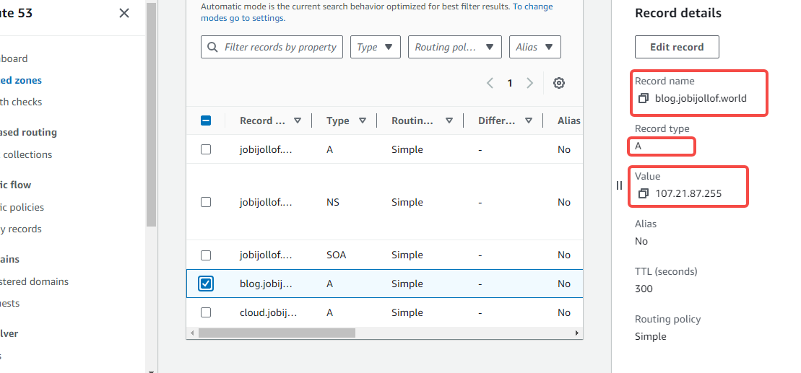
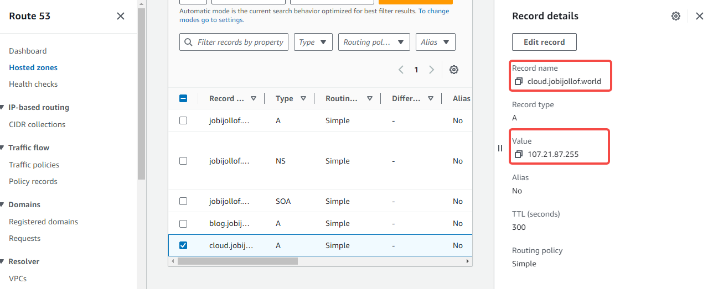
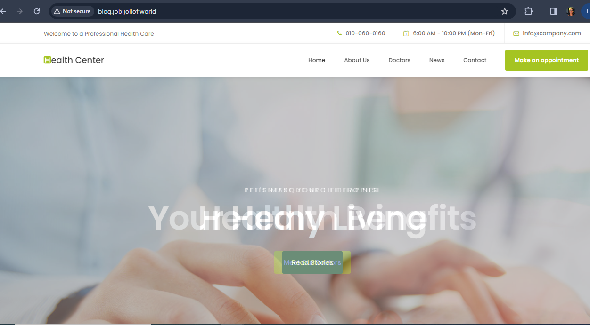
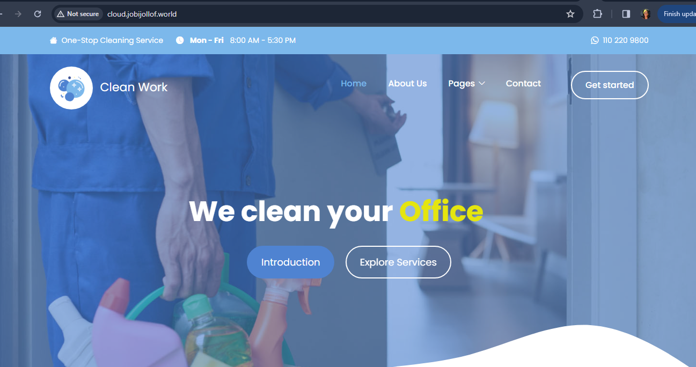
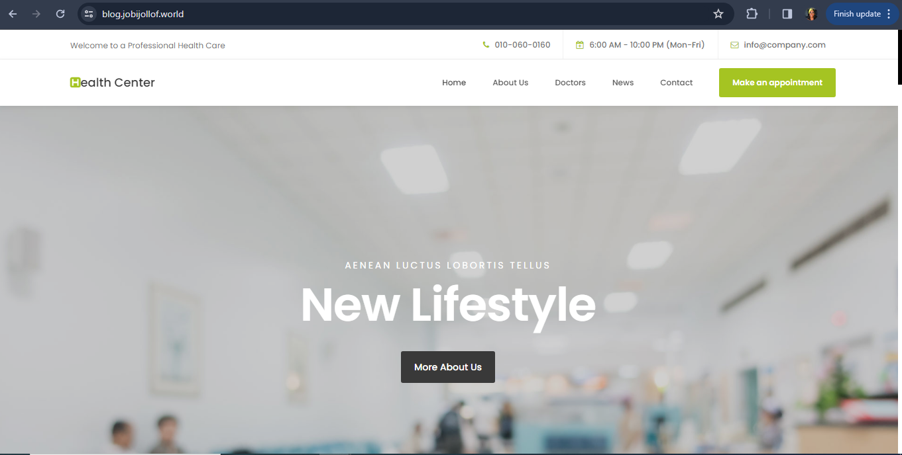
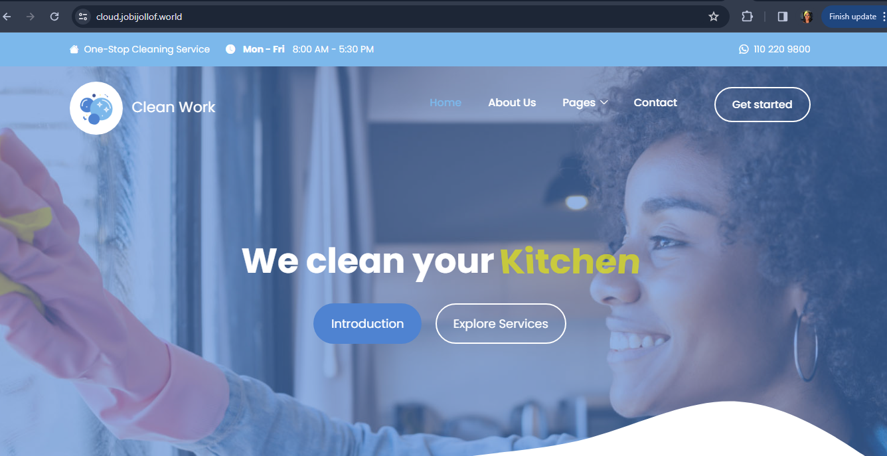

[Check here for steps to set up server and configure Nginx](https://github.com/Jobijollof/DevOps-Projects3/tree/main/Project-1)

1. **Create Two Subdomains:**
- Log in to Route 53 on AWS.
- Add DNS records for two subdomains, pointing them to the server's IP.




2. **Install and Configure Nginx:**

- Connect to your server via SSH (Replace your_username with your server username and your_server_ip with your server's IP address).
`ssh your_username@your_server_ip`

- Install Nginx: `sudo apt-get update && sudo apt-get install nginx`.
   - Start Nginx: `sudo systemctl start nginx`.
   - Enable it to start on boot: `sudo systemctl enable nginx`.

3. **Create Website Directories:**
   - Create two directories for your websites, e.g., `/var/www/site1` and `/var/www/site2`.
   - Upload your website templates to these directories.
   see [project 1](https://github.com/Jobijollof/DevOps-Projects3/tree/main/Project-1)

4. **Configure Virtual Hosts:**
   - Create Nginx configuration files for each site in `/etc/nginx/sites-available/`.

`sudo nano /etc/nginx/sites-available/your_website`

```
server {
    listen 80;
    server_name your_domain.com www.your_domain.com;

    root /path/on/server;
    index index.html;

    location / {
        try_files $uri $uri/ =404;
    }
}

```
- Configure each file with the appropriate settings, specifying the respective website directories.

5. **Add IP as A Record:**
   - In your domain registrar's control panel, add A records for your two subdomains, pointing to your server's IP.

6. **Validate Subdomains:**
   - Ensure DNS has propagated by running `nslookup subdomain1.yourdomain.com` and `nslookup subdomain2.yourdomain.com`.
   - Access each subdomain via a web browser to check if they are correctly pointing to the respective directories.
   

   

7. **Create Wildcard Let's Encrypt SSL Certificate:**
   - Install Certbot: `sudo apt-get install certbot`.
   - Run Certbot to obtain a wildcard certificate: `sudo certbot certonly --manual -d *.yourdomain.com`.

8. **Configure Wildcard SSL on Nginx:**
   - Update your Nginx configuration files to include SSL settings.
   - Specify the paths to the obtained Let's Encrypt certificates.



